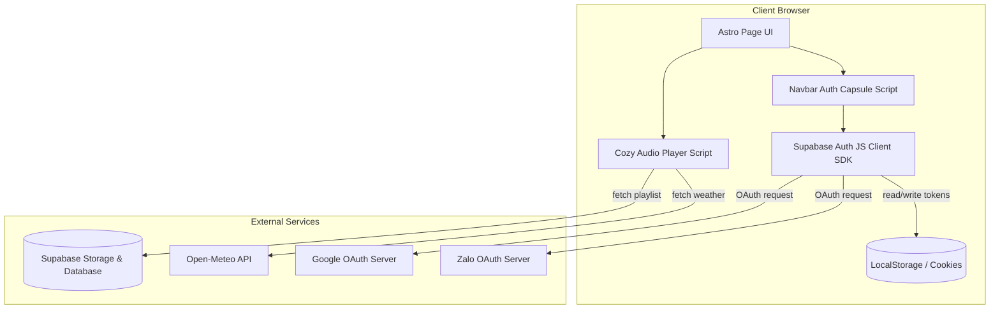
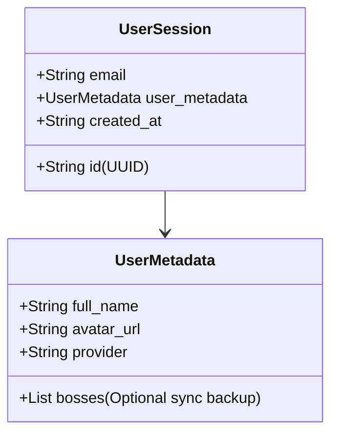
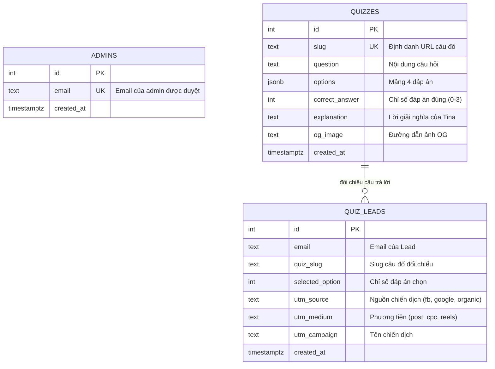
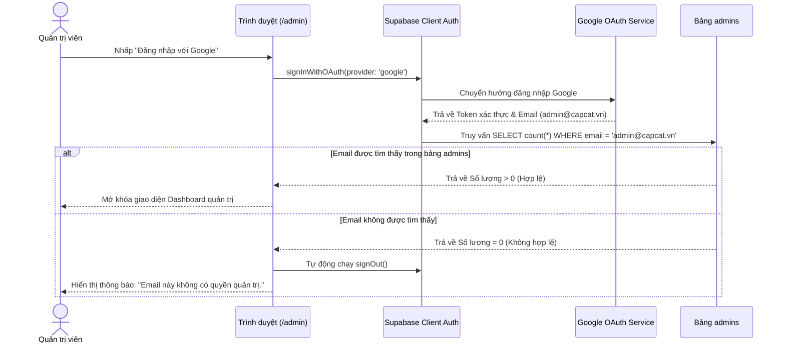
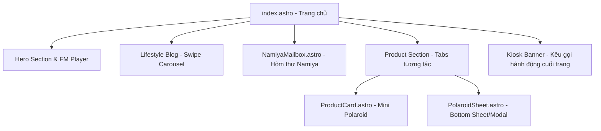
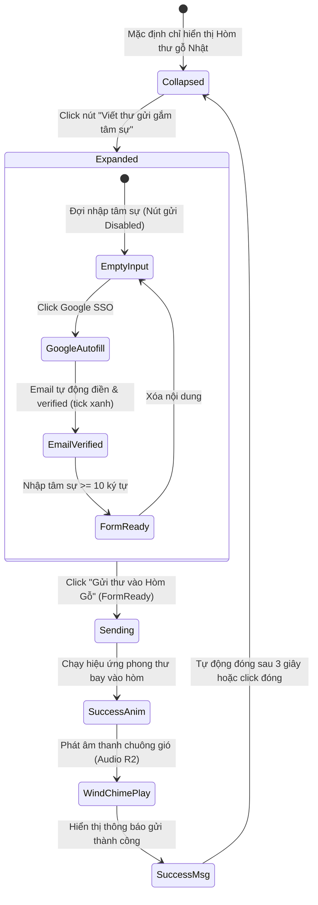

# System Architecture Diagrams - DOCA FM & SSO Integration

This document defines the C4 architectural diagrams and data representations for the DOCA FM real-time synchronization and the Supabase SSO authentication flow.

## 1. C4 Context Diagram


---

## 2. Container/Component Diagram



---

## 3. Data Model

### 3.1. LocalStorage Cache Structure (Pet Profiles)
To maintain user pet profiles under key `doca_user_bosses`:

```json
[
  {
    "id": "uuid-v4",
    "name": "Bánh Mì",
    "species": "Cat",
    "age": 2,
    "created_at": "2026-07-06T14:00:00Z"
  }
]
```

### 3.2. Supabase User Metadata Structure
When logged in, user session profile details returned by Supabase Auth (`supabase.auth.getUser()`):



---

## 4. Sơ đồ thành phần C4 - Admin Dashboard & UTM Tracking (C4 Component Diagram)

```mermaid
graph TD
    User[Người dùng / Khách truy cập]
    Admin[Quản trị viên / Marketer]
    Google[Google Identity Service]
    
    subgraph DOCA Astro Web Application
        QuizRoute[/quiz/slug]
        AdminRoute[/admin/*]
        AuthModule[Supabase Auth Integration]
        UTMParser[UTM JS Parser]
    end

    subgraph Supabase Back-end
        DB_Leads[(Bảng: quiz_leads)]
        DB_Quizzes[(Bảng: quizzes)]
        DB_Admins[(Bảng: admins)]
    end

    User -->|Xem trang chứa UTM| QuizRoute
    QuizRoute -->|Đọc tham số UTM| UTMParser
    User -->|Gửi câu trả lời| DB_Leads
    
    Admin -->|Truy cập trang quản trị| AdminRoute
    AdminRoute -->|Chuyển hướng xác thực| AuthModule
    AuthModule -->|Xác thực SSO| Google
    AdminRoute -->|Đọc/Ghi câu hỏi| DB_Quizzes
    AdminRoute -->|Xem & tải danh sách| DB_Leads
    AuthModule -->|So khớp email| DB_Admins
```

## 5. Sơ đồ mô hình dữ liệu (ERD)



## 6. Quy trình đăng nhập Google SSO & Phân quyền (Sequence Diagram)



---

## 7. Sơ đồ cấu trúc phân bố Layout Trang Chủ mới



---

## 8. Sơ đồ trạng thái Hòm thư Namiya (Namiya Mailbox State Diagram)


