# System Architecture Diagrams - DOCA FM & SSO Integration

This document defines the C4 architectural diagrams and data representations for the DOCA FM real-time synchronization and the Supabase SSO authentication flow.

## 1. C4 Context Diagram

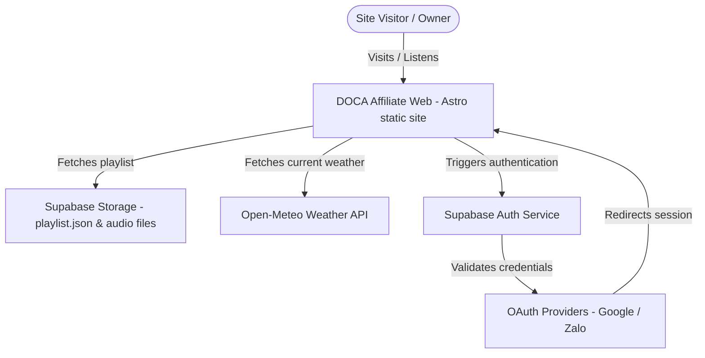

---

## 2. Container/Component Diagram

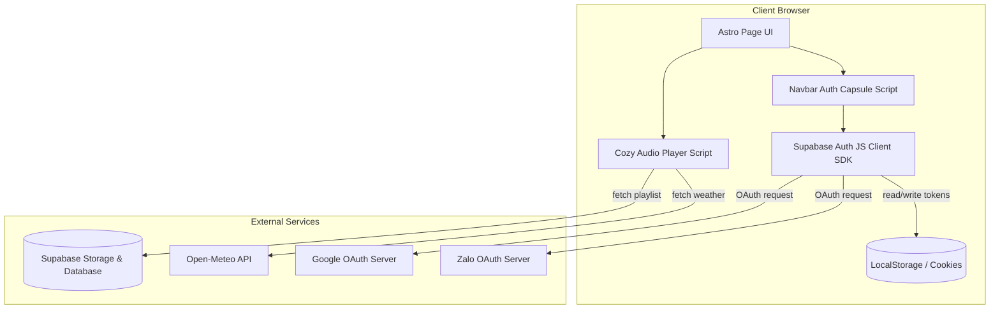

---

## 3. Data Model

### 3.1. LocalStorage Cache Structure (Pet Profiles)
To maintain user pet profiles under key `doca_user_bosses`:

```json
[
  {
    "id": "uuid-v4",
    "name": "Bánh Mì",
    "species": "Cat",
    "age": 2,
    "created_at": "2026-07-06T14:00:00Z"
  }
]
```

### 3.2. Supabase User Metadata Structure
When logged in, user session profile details returned by Supabase Auth (`supabase.auth.getUser()`):

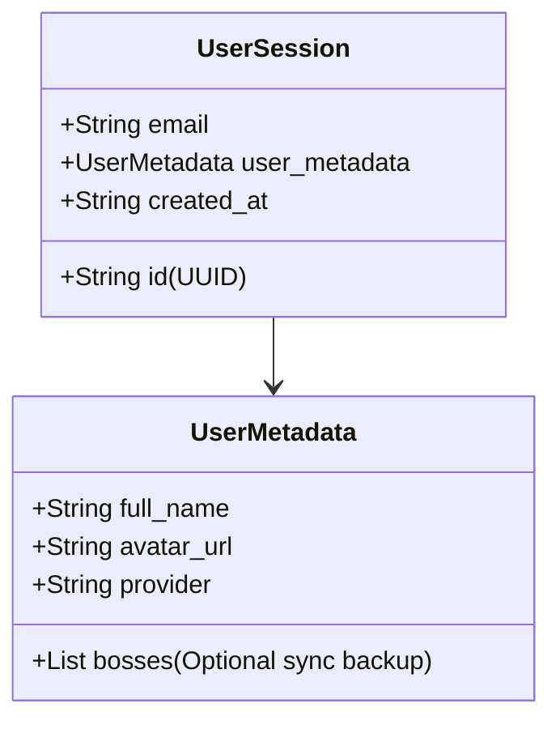

---

## 4. Sơ đồ thành phần C4 - Admin Dashboard & UTM Tracking (C4 Component Diagram)

```mermaid
graph TD
    User[Người dùng / Khách truy cập]
    Admin[Quản trị viên / Marketer]
    Google[Google Identity Service]
    
    subgraph DOCA Astro Web Application
        QuizRoute[/quiz/slug]
        AdminRoute[/admin/*]
        AuthModule[Supabase Auth Integration]
        UTMParser[UTM JS Parser]
    end

    subgraph Supabase Back-end
        DB_Leads[(Bảng: quiz_leads)]
        DB_Quizzes[(Bảng: quizzes)]
        DB_Admins[(Bảng: admins)]
    end

    User -->|Xem trang chứa UTM| QuizRoute
    QuizRoute -->|Đọc tham số UTM| UTMParser
    User -->|Gửi câu trả lời| DB_Leads
    
    Admin -->|Truy cập trang quản trị| AdminRoute
    AdminRoute -->|Chuyển hướng xác thực| AuthModule
    AuthModule -->|Xác thực SSO| Google
    AdminRoute -->|Đọc/Ghi câu hỏi| DB_Quizzes
    AdminRoute -->|Xem & tải danh sách| DB_Leads
    AuthModule -->|So khớp email| DB_Admins
```

## 5. Sơ đồ mô hình dữ liệu (ERD)

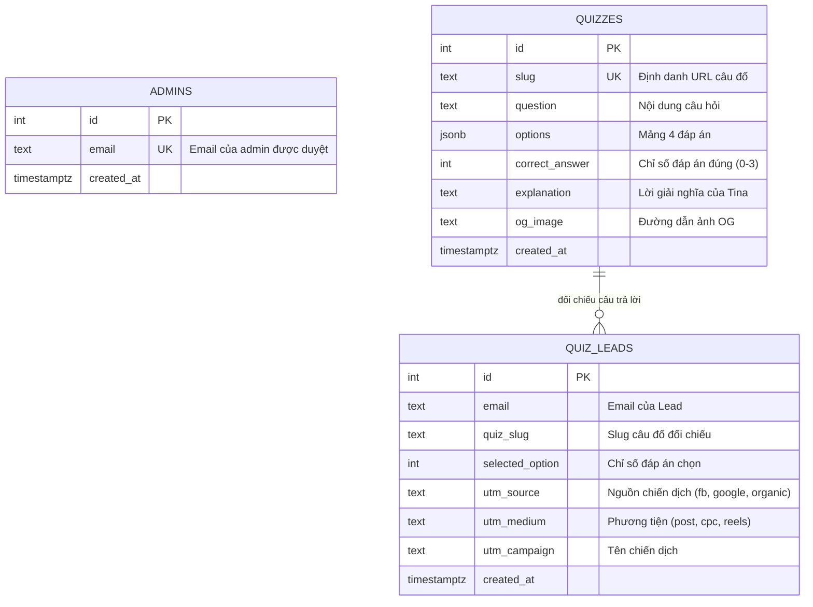

## 6. Quy trình đăng nhập Google SSO & Phân quyền (Sequence Diagram)

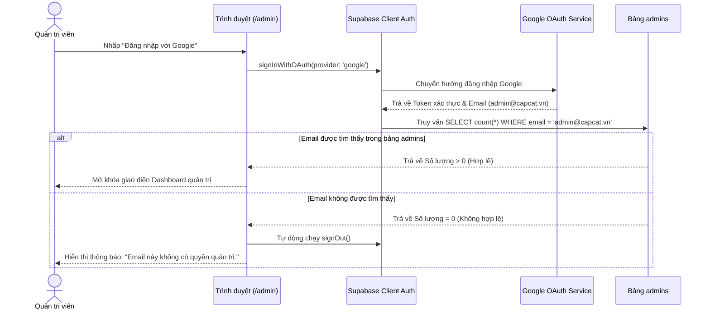

---

## 7. Sơ đồ cấu trúc phân bố Layout Trang Chủ mới

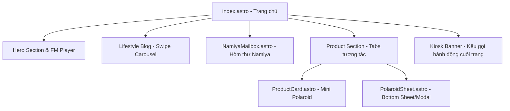

---

## 8. Sơ đồ trạng thái Hòm thư Namiya (Namiya Mailbox State Diagram)

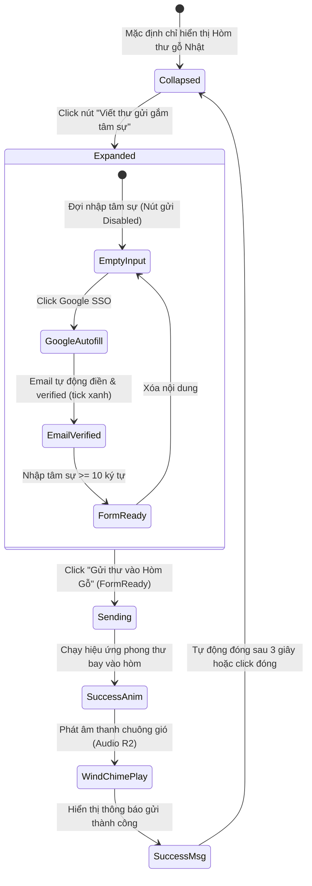

---

## 9. Sơ đồ cấu trúc C4 - Phân hệ Ví Xu & Thanh toán (C4 Component Diagram)

Quy hoạch hệ thống Ví Xu kết nối các cổng thanh toán và công cụ kế toán:

```mermaid
graph TD
    User[Người dùng / Khách mua xu]
    Admin[Quản trị viên / Kế toán]
    
    subgraph Client Application (Astro Frontend)
        UI_Profile[Trang Hồ sơ /profile]
        UI_Wallet[Trang Nạp xu /profile/wallet]
        UI_AdminBilling[Trang Admin Billing /admin/billing/*]
    end

    subgraph Backend API (Astro API Routes)
        API_Recharge[/api/billing/recharge]
        API_Webhook[/api/billing/webhook/*]
        API_Report[/api/billing/report]
        Core_Wallet[Core Wallet Service]
        Order_Manager[Order Billing Service]
        Provider_Adapter[Payment Providers Adapter]
    end

    subgraph Infrastructure
        DB[(PostgreSQL Database)]
        Redis[(Redis Idempotency Store)]
    end

    subgraph External Gateways
        ZP[Cổng ZaloPay Open API]
        Momo[Cổng MoMo Business API]
        Invoice[API Hóa đơn Misa MeInvoice]
    end

    User -->|Xem số dư & nạp xu| UI_Profile
    User -->|Chọn gói & thanh toán| UI_Wallet
    UI_Wallet -->|Gọi API nạp| API_Recharge
    
    API_Recharge --> Order_Manager
    Order_Manager --> Provider_Adapter
    Provider_Adapter -->|Tạo yêu cầu thanh toán| ZP
    Provider_Adapter -->|Tạo yêu cầu thanh toán| Momo

    ZP -->|IPN Webhook| API_Webhook
    Momo -->|IPN Webhook| API_Webhook
    
    API_Webhook --> Order_Manager
    Order_Manager -->|Đối soát & Khóa ví| Redis
    Order_Manager -->|Cập nhật & ghi nhận log| Core_Wallet
    Core_Wallet -->|Database Transaction| DB

    Admin -->|Đối soát & xem báo cáo| UI_AdminBilling
    UI_AdminBilling -->|Yêu cầu báo cáo| API_Report
    API_Report --> DB
    
    %% Tác vụ tự động
    Cron[Cron Job Serverless] -->|Gom doanh thu & gọi xuất| Invoice
    API_Report -->|Đẩy hóa đơn tổng| Invoice
```

---

## 10. Sơ đồ thực thể cơ sở dữ liệu (ERD - Billing System)

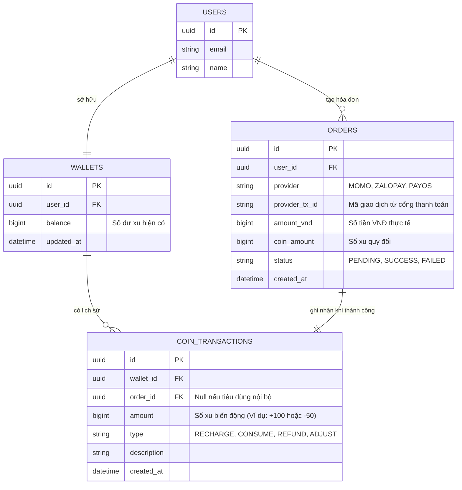

---

## 11. Sơ đồ trạng thái Giao dịch Thanh toán (Payment Transaction State Diagram)

Mô tả vòng đời của đơn nạp tiền từ lúc khởi tạo đến khi xử lý cộng xu:

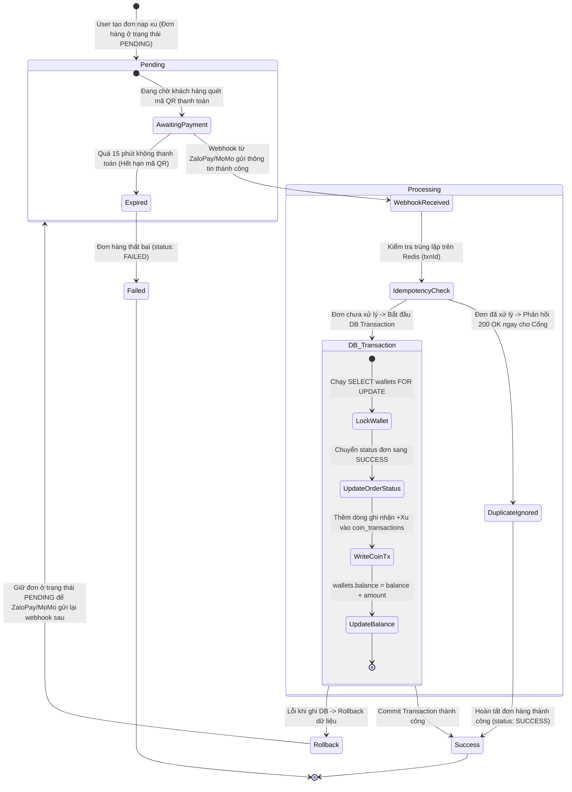


---

# System Architecture Diagrams - Capcat Coin Hub (`apps/coin-hub`)

## 1. C4 Container Diagram

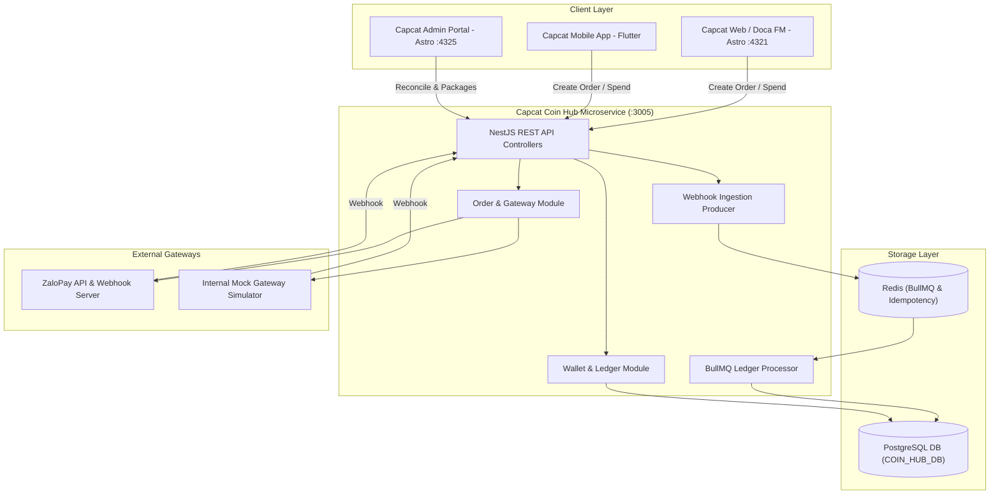

## 2. Relational Database Schema (PostgreSQL ERD)

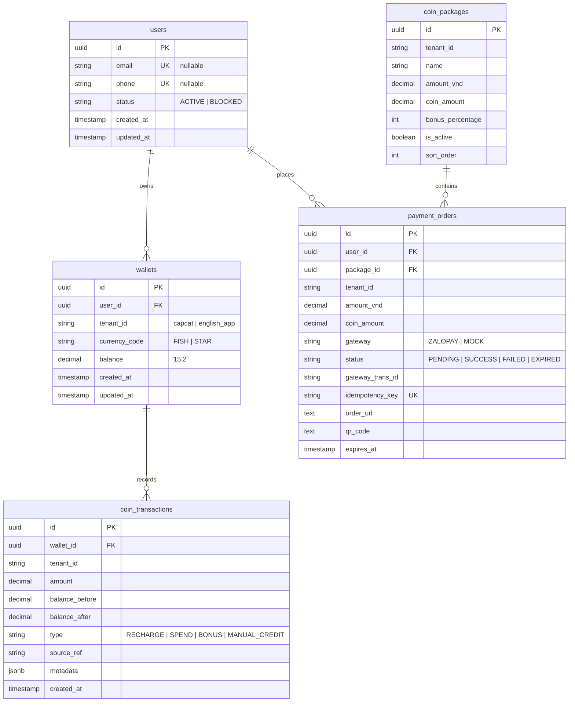
