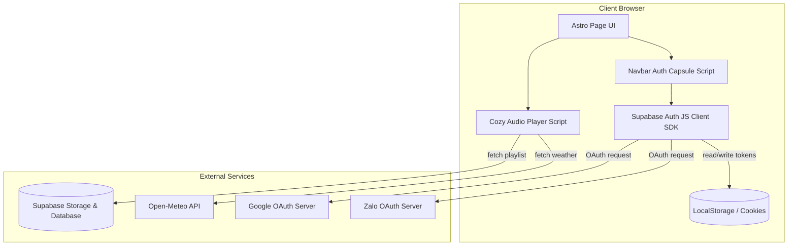
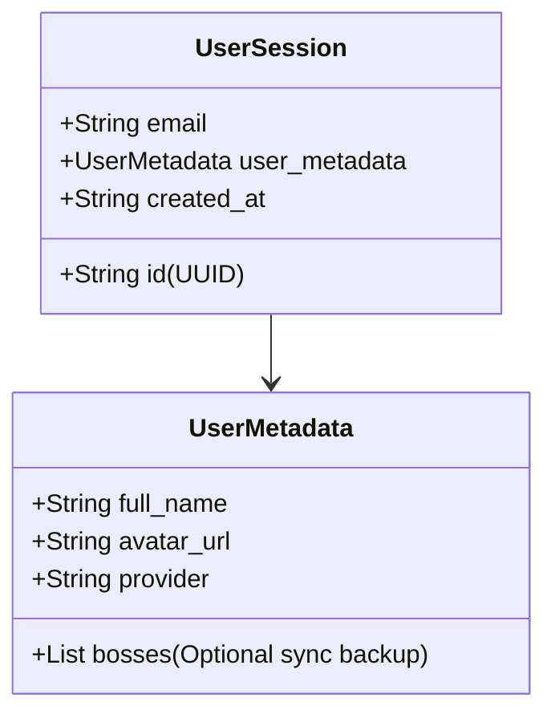

# System Architecture Diagrams - DOCA FM & SSO Integration

This document defines the C4 architectural diagrams and data representations for the DOCA FM real-time synchronization and the Supabase SSO authentication flow.

## 1. C4 Context Diagram


---

## 2. Container/Component Diagram



---

## 3. Data Model

### 3.1. LocalStorage Cache Structure (Pet Profiles)
To maintain user pet profiles under key `doca_user_bosses`:

```json
[
  {
    "id": "uuid-v4",
    "name": "Bánh Mì",
    "species": "Cat",
    "age": 2,
    "created_at": "2026-07-06T14:00:00Z"
  }
]
```

### 3.2. Supabase User Metadata Structure
When logged in, user session profile details returned by Supabase Auth (`supabase.auth.getUser()`):


