# System and User Flows - DOCA FM & SSO Integration

This document details the user-facing and backend system flows for the live synchronized FM player and the client-side SSO authentication system.

## 1. Client-Side Playlist & Weather Loading Flow

The sequence of actions when a user visits the website:

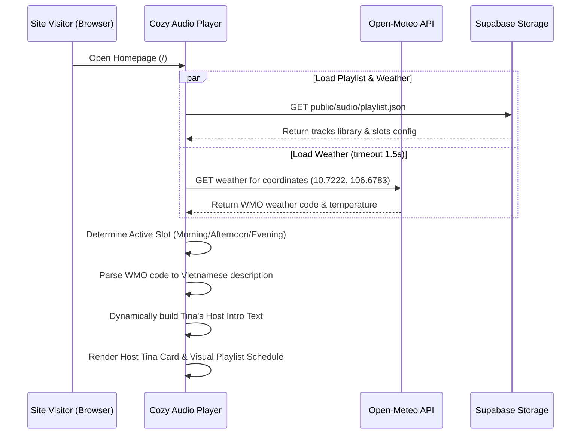

---

## 2. Playback FM Synchronization Flow

When the user interacts with the music controls, playback is synchronized in real-time:

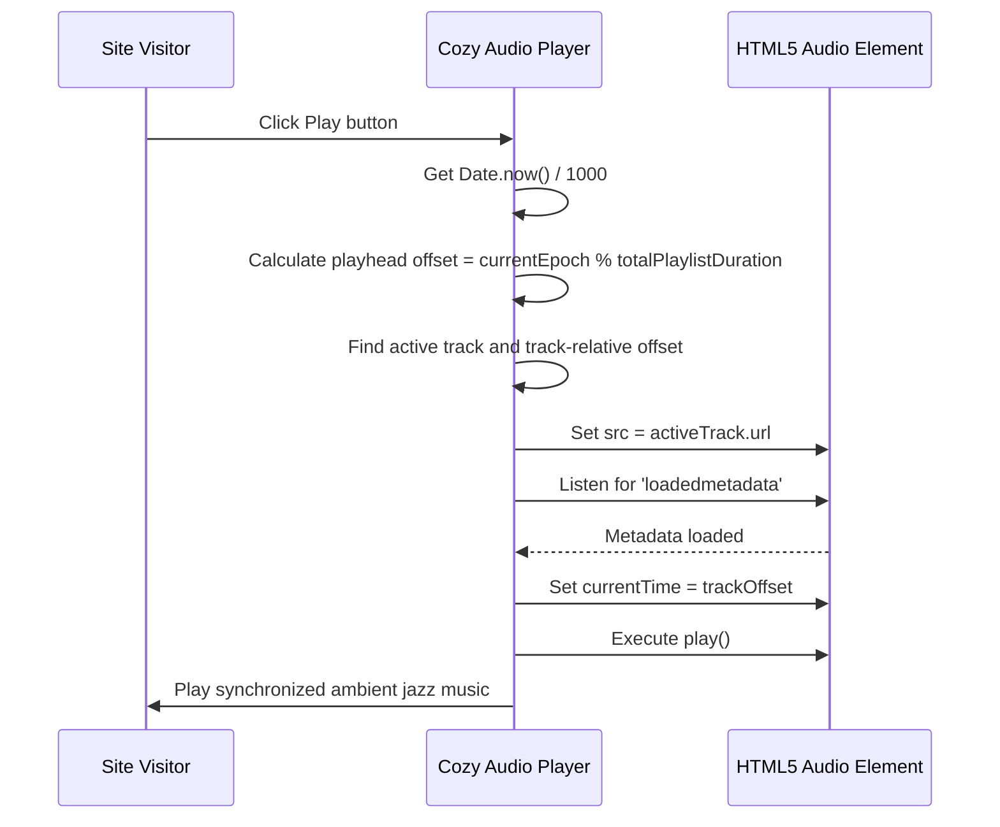

---

## 3. SSO Login Redirection & Callbacks Flow

When a user clicks "Đăng nhập" and selects an SSO provider:

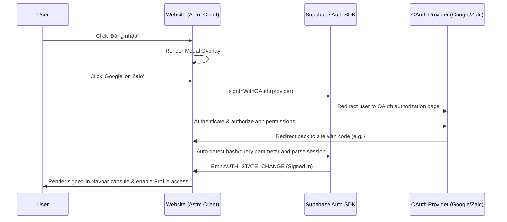

---

## 4. Navigation Bar Auth Synchronization Flow

On page mount, the Navbar establishes the authentication capsule:

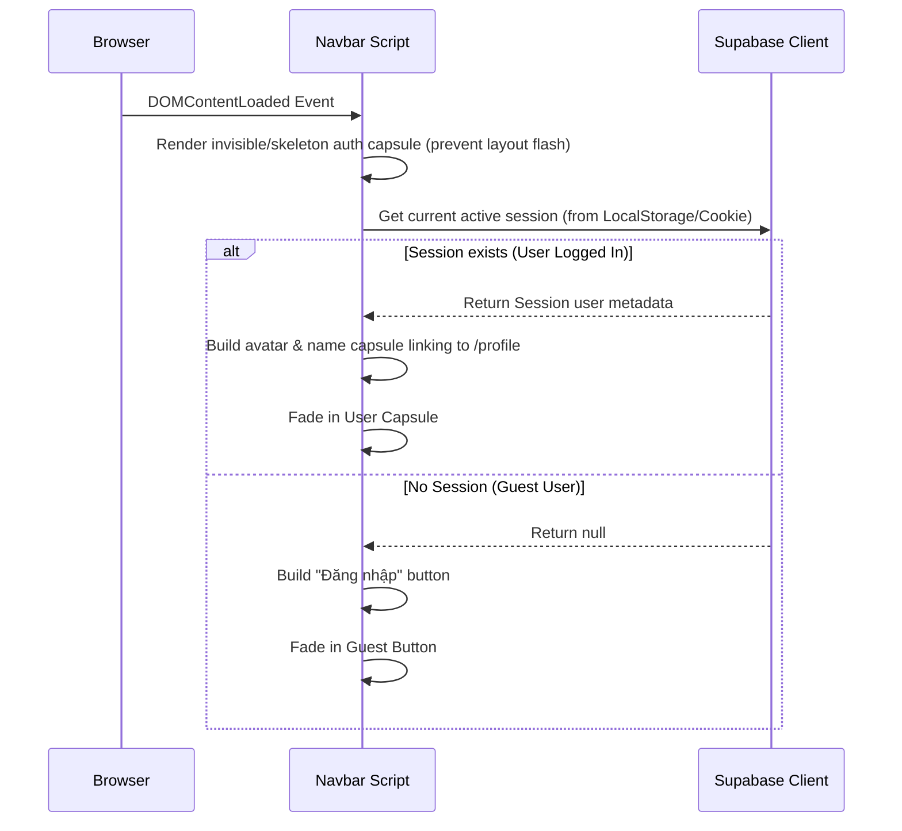

---

## 5. Quy trình trích xuất UTM và gửi kèm Lead Email

Khi khách truy cập nhấp vào liên kết từ mạng xã hội có chứa UTM parameters:

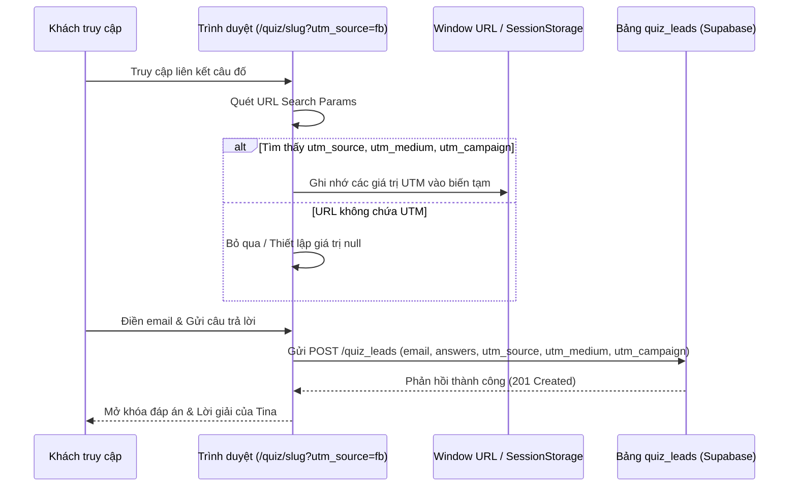

---

## 6. Quy trình Admin chỉnh sửa câu hỏi & Kích hoạt Webhook build lại trang tĩnh

Khi quản trị viên thực hiện lưu chỉnh sửa một câu hỏi trắc nghiệm:

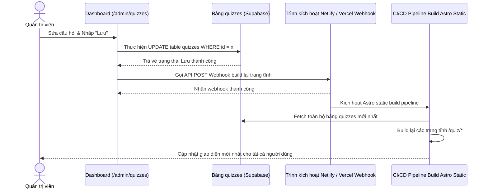

---

## 7. Quy trình tương tác trượt mở Hòm thư Namiya & Điền nhanh Google SSO

Khi khách truy cập muốn gửi thư tâm sự ẩn danh:

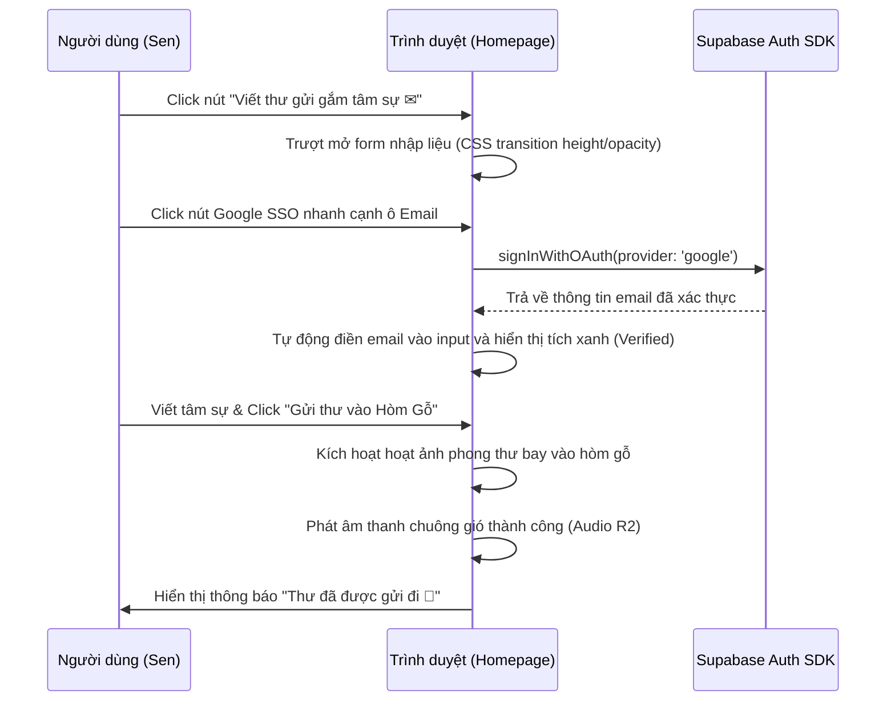

---

## 8. Quy trình chuyển Tab Kệ quà của mẹ không reload trang

Khi người dùng lọc sản phẩm theo Boss:

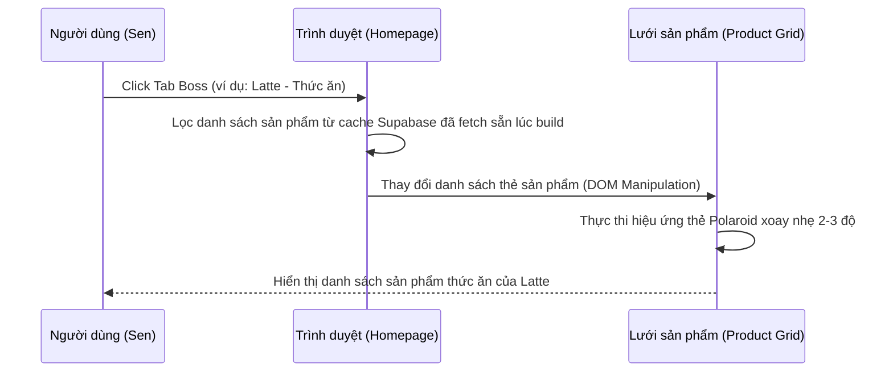

---

## 9. Quy trình nạp xu qua cổng ZaloPay/MoMo (Web to App)

Khi người dùng thực hiện nạp xu thông qua giao diện ứng dụng:

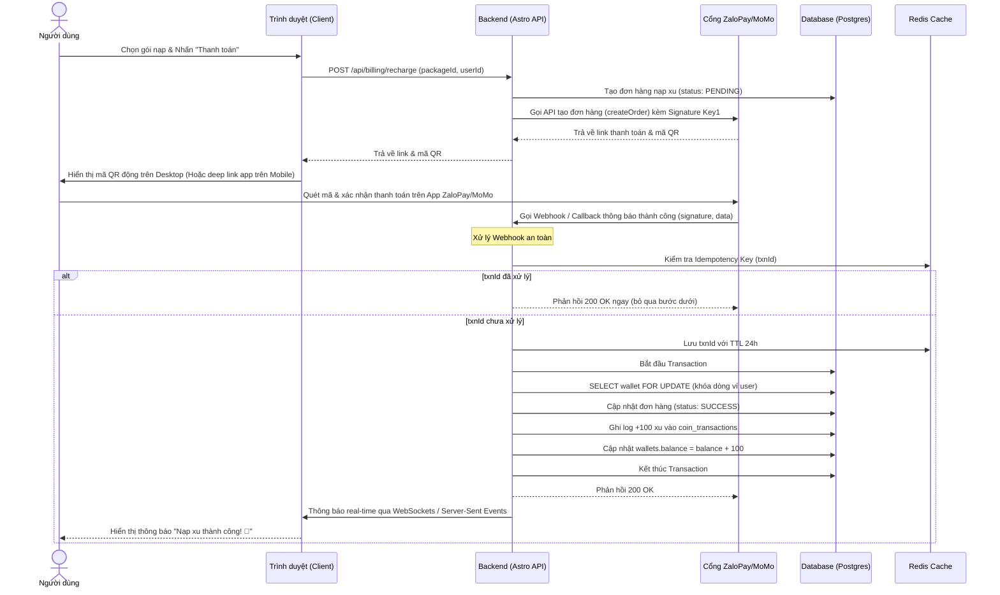

---

## 10. Quy trình đối soát tự động hàng ngày cho Kế toán (Automated Reconciliation)

Quy trình tự động hóa đối khớp doanh thu vào ban đêm:

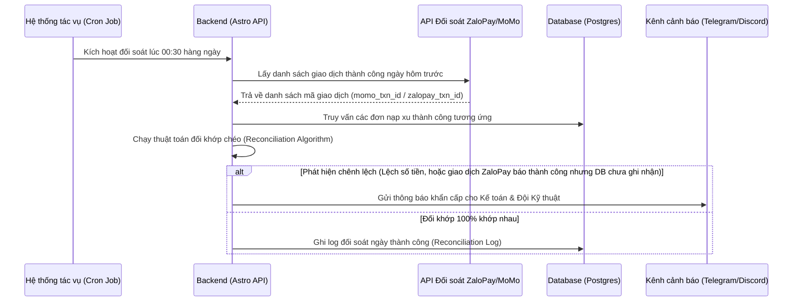

---

## 11. Quy trình xuất hóa đơn điện tử tự động cuối ngày (Daily Automated E-Invoicing)

Để tối ưu hóa thủ tục xuất hóa đơn thuế cho các giao dịch nạp xu lẻ:

```mermaid
sequenceDiagram
    participant Cron as Hệ thống tác vụ (Cron Job)
    participant API as Backend (Astro API)
    participant DB as Database (Postgres)
    participant Invoice as API Hóa đơn điện tử (Misa MeInvoice)

    Cron->>API: Kích hoạt xuất hóa đơn tổng lúc 23:55 hàng ngày
    API->>DB: Tính tổng doanh thu nạp xu thành công trong ngày
    DB-->>API: Trả về tổng tiền (Ví dụ: 1,500,000đ)
    API->>Invoice: Gửi yêu cầu POST /invoices (xuất 01 hóa đơn tổng ghi nhận doanh thu dịch vụ trong ngày)
    Invoice->>Invoice: Xác thực & Ký số hóa đơn điện tử
    Invoice-->>API: Trả về mã số hóa đơn & file PDF
    API->>DB: Lưu thông tin hóa đơn vào bảng nhật ký thuế


---

# System and User Flows - Doca Coin Hub (`apps/coin-hub`)

## 1. Payment Inflow & Coin Recharge Flow (ZaloPay & Mock)

```mermaid
sequenceDiagram
    autonumber
    actor User as User (Sen / Mobile / Web)
    participant Client as Client App (Astro / Flutter)
    participant Hub as Coin Hub API (:3005)
    participant Gateway as Payment Gateway (ZaloPay / Mock)
    participant Queue as BullMQ (Redis)
    participant Worker as Ledger Worker
    participant DB as PostgreSQL (Coin Hub DB)

    User->>Client: Select Coin Package (e.g. 10,000 VND = 100 Cá)
    Client->>Hub: POST /api/v1/orders/create { tenant_id: 'doca', email/phone, package_id, gateway }
    Hub->>DB: Find or create User & Wallet
    Hub->>DB: INSERT payment_orders (status: 'PENDING')
    Hub->>Gateway: Create Order (amount, order_id, HMAC)
    Gateway-->>Hub: Return order_url, qr_code, app_trans_token
    Hub-->>Client: Return Order Response (QR code + Deep link)
    
    alt Desktop Web
        Client->>User: Display Dynamic QR Code Modal
        User->>Gateway: Scan QR code with ZaloPay App & Confirm Pay
    else Mobile App
        Client->>User: App-to-App Deep Link Redirect
        User->>Gateway: Authorize Payment in ZaloPay App
    end

    Gateway->>Hub: POST /api/v1/webhooks/zalopay (callback data + mac)
    Hub->>Hub: Verify HMAC-SHA256 signature
    Hub->>Queue: Enqueue job { order_id, gateway_trans_id, amount }
    Hub-->>Gateway: HTTP 200 { return_code: 1, return_message: 'success' } (<50ms)

    Queue->>Worker: Pick job 'ledger-credit-job'
    Worker->>DB: BEGIN TRANSACTION
    Worker->>DB: SELECT wallet FOR UPDATE (Row Lock)
    Worker->>DB: UPDATE payment_orders SET status = 'SUCCESS'
    Worker->>DB: INSERT coin_transactions (+100 Cá, type: 'RECHARGE')
    Worker->>DB: UPDATE wallets SET balance = balance + 100
    Worker->>DB: COMMIT TRANSACTION
    Worker->>Client: Emit Realtime Noti / Client Polls GET /orders/:id/status
    Client->>User: Display "Nạp Cá Thành Công!" & Update Balance Box
```

## 2. Coin Spend & Feature Unlock Flow

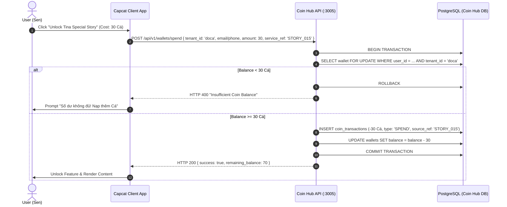
