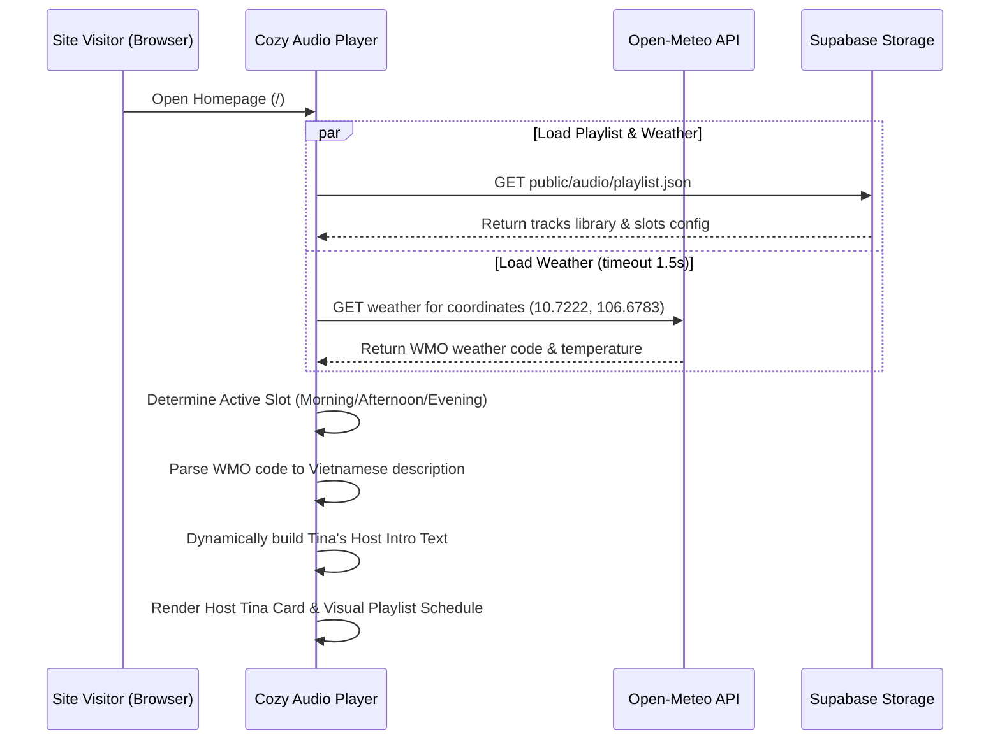
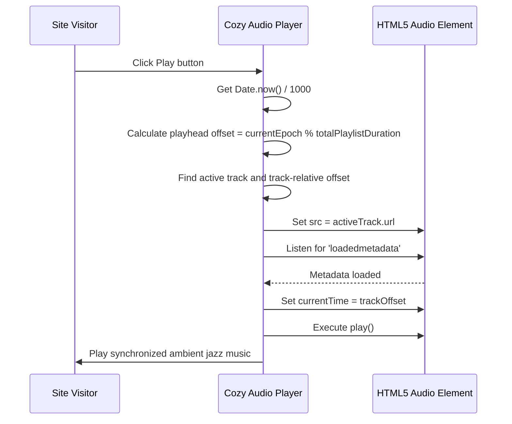
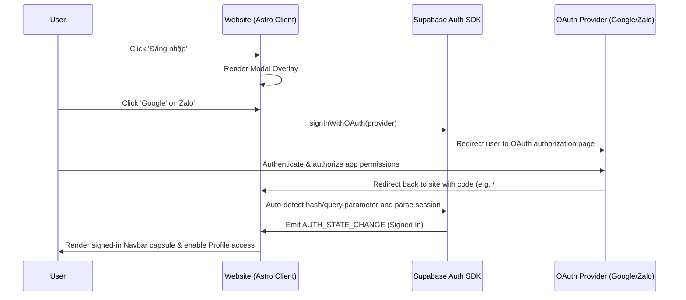
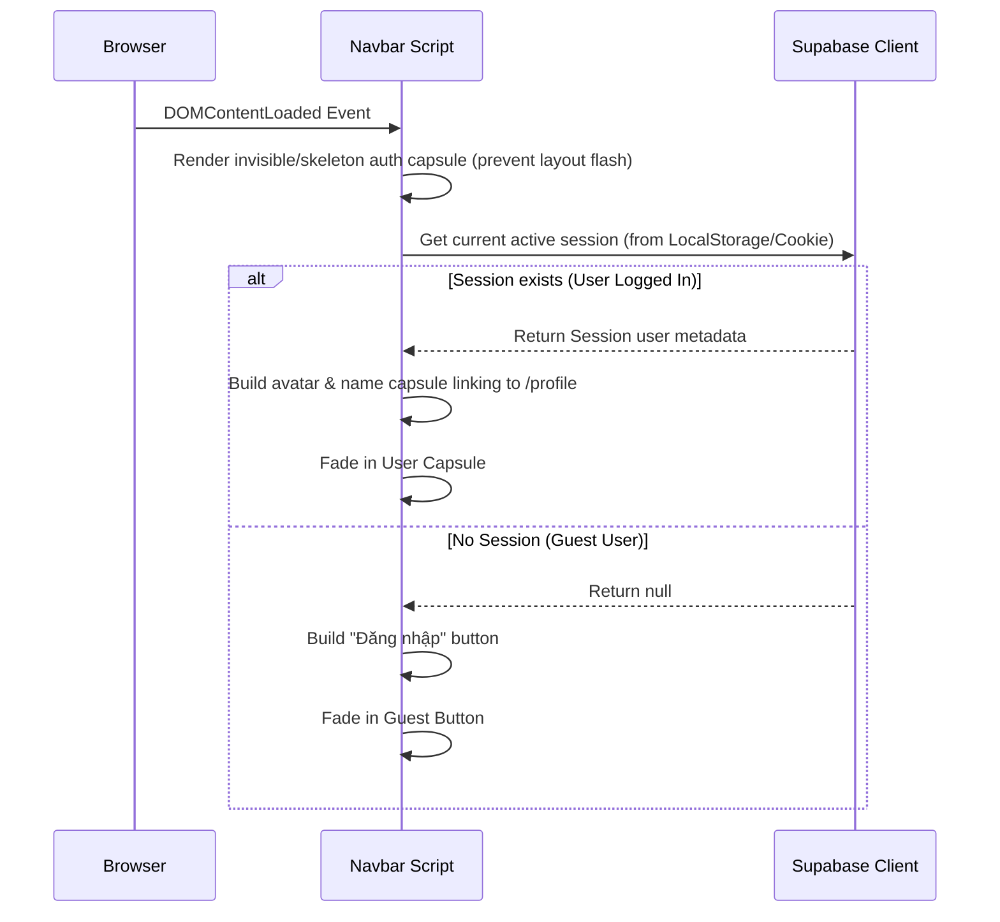

# System and User Flows - DOCA FM & SSO Integration

This document details the user-facing and backend system flows for the live synchronized FM player and the client-side SSO authentication system.

## 1. Client-Side Playlist & Weather Loading Flow

The sequence of actions when a user visits the website:

---

## 2. Playback FM Synchronization Flow

When the user interacts with the music controls, playback is synchronized in real-time:

---

## 3. SSO Login Redirection & Callbacks Flow

When a user clicks "Đăng nhập" and selects an SSO provider:

---

## 4. Navigation Bar Auth Synchronization Flow

On page mount, the Navbar establishes the authentication capsule:

