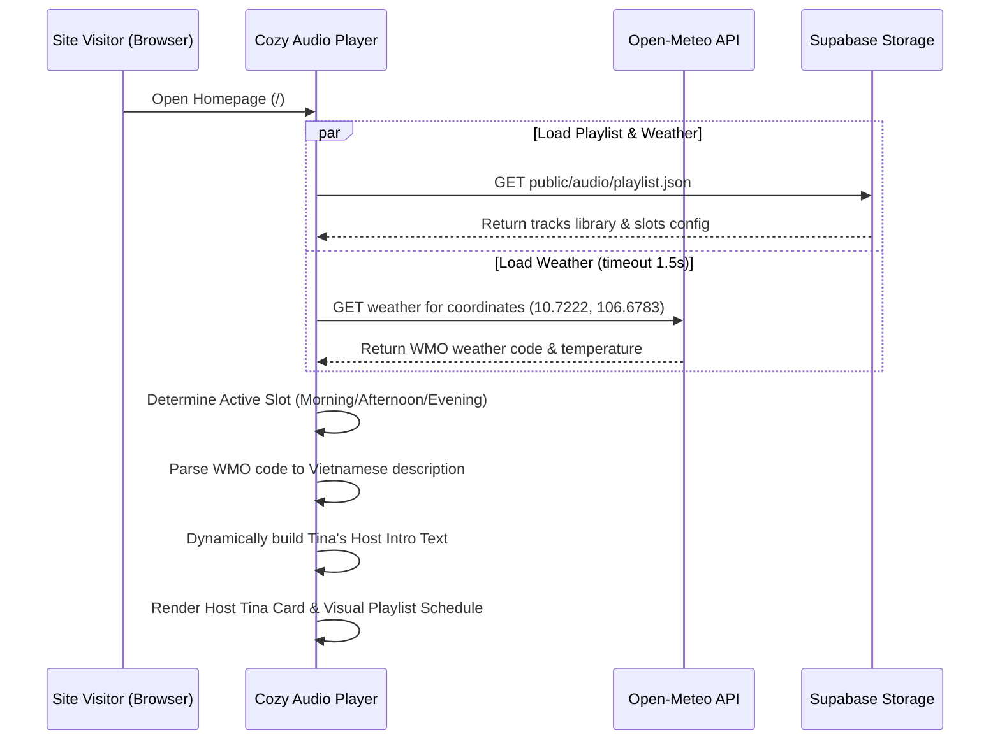
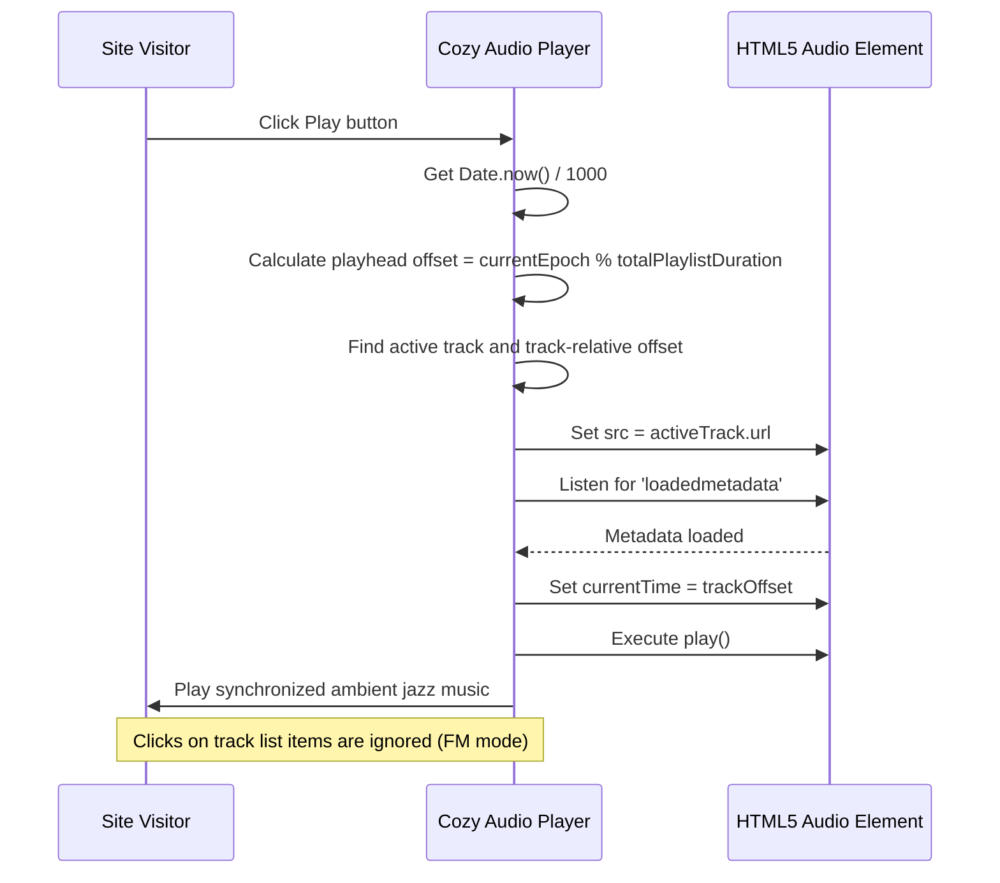

# System and User Flows - DOCA FM Live Sync & Weather Integration

This document details the user-facing and backend system flows for the live synchronized FM player, weather API fetching, and playlist rotation.

## 1. Client-Side Playlist & Weather Loading Flow

The sequence of actions when a user visits the website:

---

## 2. Playback FM Synchronization Flow

When the user interacts with the music controls, playback is synchronized in real-time across all users:

---

## 3. Failure & Recovery Flows

### Failure Mode 1: Open-Meteo Weather API is slow or offline
*   **Detection:** Fetch to `api.open-meteo.com` exceeds 1.5s or returns non-200.
*   **Mitigation:** The player catches the error and falls back to a default weather description ("trời mát mẻ"). Tina's introduction text compiles normally using this fallback, preventing UI breakages.

### Failure Mode 2: Client's clock is drift or off by minutes
*   **Detection:** High offset discrepancies.
*   **Mitigation:** We accept standard OS-level NTP drift (1-3s). If the clock is completely off, the music will still play correctly and loop locally, but the playhead synchronization will be offset relative to other users. No crash occurs.
